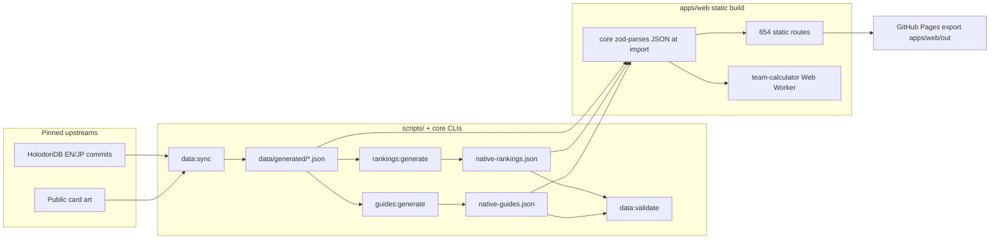
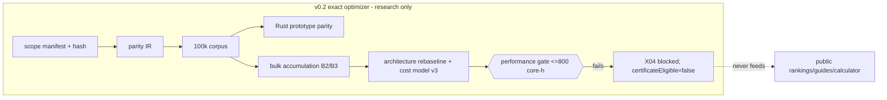

# Yagoo-dori Architecture Documentation

## 1. How to Read This Document

This document describes the actual architecture of the Yagoo-dori repository for
contributors and agents working on the codebase. Sections 2–7 cover the
universal picture (purpose, stack, structure, build, configuration). Sections
8–12 cover the web frontend. Sections 13–16 cover the domain core: the data
pipeline, the evaluation/ranking engine, and the exact-optimizer certification
subsystem. Closing sections cover data flow, errors, testing, performance,
security, and deployment.

Authoritative companions: [AGENTS.md](../AGENTS.md) (repository charter and
verification order), [docs/data-dictionary.md](data-dictionary.md),
[docs/source-policy.md](source-policy.md), [docs/release.md](release.md), and
the exact-optimizer document set (`docs/exact-optimizer-*.md`).

## 2. Overview

Yagoo-dori is a noncommercial, English-first fan database, tier list, guide
library, and owned-roster team builder for the mobile game *hololive Dreams*,
published as a fully static site at `https://asciisyaez.github.io/yagoo-dori/`
from the public repo `asciisyaez/yagoo-dori`.

Architecturally it is three coupled systems:

1. **A static Next.js site** (`apps/web`) — 654 exported routes covering cards,
   talents, Leader Outfits, skills, synergies, tier lists, guides, changelogs,
   and a client-side team calculator that runs the real optimizer in a Web
   Worker.
2. **A deterministic domain core** (`packages/core`) — zod-validated data
   schemas, the reference relative-utility evaluator, bounded team search,
   ranking/guide generators, and CLI tools. All site content is generated data;
   there is no database, CMS, or runtime API.
3. **A research/certification subsystem (v0.2)** — the exact optimizer: parity
   harnesses, proof accounting, shard planning, and evidence artifacts aimed at
   a certifiable full-roster global optimum. It is deliberately isolated from
   the shipped v0.1 product and currently `certificateState: "not-eligible"`.

Core product invariants: rankings and recommendations come only from pinned
inputs and implemented mechanics (never editorial copy or invented equations);
public wording distinguishes exhaustively enumerated scopes from bounded
deterministic recommendations; and the sole affiliation disclaimer appears
exactly once as a muted footer line.

## 3. Technology Stack

| Layer | Technology | Version |
| --- | --- | --- |
| Package manager | pnpm (workspace) | 10.14.0 |
| Runtime | Node.js | >= 22 (CI uses 24) |
| Language | TypeScript (strict, `noUncheckedIndexedAccess`, `exactOptionalPropertyTypes`) | 6.0.3 |
| Web framework | Next.js (App Router only) | 16.2.12 |
| UI | React | 19.2.8 |
| Validation | zod (only runtime dep of core) | 4.4.3 |
| Styling | Hand-written global CSS + CSS Modules (~10k lines); Tailwind 4.3.3 is installed via PostCSS but effectively unused | — |
| Icons / motion | lucide-react, motion | 1.27.0 / 12.43.0 |
| Unit tests | Vitest | 4.1.10 |
| E2E tests | Playwright (desktop + Pixel 7 mobile projects) | 1.62.0 |
| Image tooling | sharp (preview generation) | 0.35.3 |
| Research prototype | Rust (rayon, serde) — `tools/exact-global-solver` | edition 2021 |

## 4. Project Structure

```
yagoo-dori/
├── apps/web/                  # @yagoo-dori/web — Next.js static site
│   ├── src/app/               # App Router routes (cards, talents, leaders,
│   │                          #   skills, synergies, tier-list, team-builder,
│   │                          #   guides, changelog, methodology, healthz)
│   ├── src/components/        # team-calculator, tier-list-explorer,
│   │                          #   card-catalog, site-header/footer, site-image
│   ├── src/lib/               # worker client, roster storage, site-path
│   ├── src/workers/           # team-calculator.worker.ts
│   ├── e2e/                   # Playwright specs (standalone server)
│   └── pages-e2e/             # Playwright specs (static Pages export)
├── packages/core/             # @yagoo-dori/core — all domain logic (~31.6k
│   ├── src/                   #   lines; 46 colocated *.test.ts files)
│   └── src/cli/               # validate-data, generate-rankings/guides,
│                              #   timeline sync/projection CLIs (run via tsx)
├── tools/exact-global-solver/ # Rust parity prototype (NOT a pnpm workspace
│                              #   member; disposable, never feeds the site)
├── scripts/                   # 34 Node ESM orchestration scripts (sync,
│                              #   build-pages, optimizer evidence generators)
├── data/
│   ├── sources.json           # source ledger (pinned upstreams, provenance)
│   ├── generated/             # pipeline outputs consumed by core (~16 MB)
│   └── native/                # pinned methodology inputs + optimizer
│                              #   evidence artifacts (~61 MB)
├── docs/                      # architecture, specs, policies, TRIP docs
├── .codex/                    # epic/ticket state store (authoritative
│                              #   project status; parsed by project-status)
├── .agents/skills/            # repo-scoped maintenance skills
└── .github/workflows/         # ci.yml, pages.yml (double-gated deploy)
```

## 5. Core Architecture Principles

- **Determinism everywhere**: fixed seeds (`0x5941474F`), pinned upstream
  commits, frozen benchmarks, content-addressed (SHA-256) evidence artifacts.
  Generated outputs change only when methodology identifiers change.
- **TypeScript is the semantic authority**: `native-utility.ts` is the
  reference evaluator; compiled paths (Rust, bulk accumulators) must prove
  exact canonical parity before receiving any trust — and even then remain
  accelerators, not authorities.
- **Honest claims discipline**: exhaustive results are labeled only for scopes
  actually enumerated; bounded search is called bounded; nothing is called
  exact, optimal, certified, or a proof unless the corresponding gate passed.
  `certificateEligible` / `fullRunAuthorized` stay `false` until earned.
- **Exact integer comparison**: utilities compare as six-decimal signed integer
  micro-units (`yd-canonical-micro-units-1.0.0`); no floating-point epsilon may
  establish parity, ties, pruning, or optimality.
- **Data-as-code**: generated JSON is imported and zod-parsed at module load,
  type-checked alongside the code (core's tsconfig includes `data/**/*.json`),
  and inlined into the static export at build time.
- **v0.1 / v0.2 separation**: the live product's bounded-search contract is
  complete and verified; exact certification is separately scoped research that
  must never silently alter public claims, rankings, or guides.
- **Weighted evidence-based progress**: `.codex/` epics/tickets are the project
  state; `pnpm project:status` counts only `done` tickets — blocked or rejected
  work earns no progress.

## 6. Build System & Toolchain

- `pnpm dev` — Next dev server for `@yagoo-dori/web` at `127.0.0.1:3000`.
- `pnpm build` — `assets:check` → `data:validate` → `next build` (standalone
  output); `pnpm start` runs the standalone server via
  `scripts/start-standalone.mjs`.
- `pnpm build:pages` — `scripts/build-pages.mjs` sets
  `YAGOO_DORI_DEPLOY_TARGET=github-pages`, builds a repository-subpath-safe
  static export into `apps/web/out`, then asserts every asset reference is
  base-path-prefixed. `pnpm preview:pages` serves it on port 3100.
- `pnpm lint` — ESLint 9 flat config for web; core's lint is `tsc --noEmit`.
- `pnpm typecheck` / `pnpm test` — recursive per-package tsc / Vitest.
- Optimizer evidence: ~30 `optimizer:*` root scripts run `scripts/*.mjs` (many
  via `node --import tsx/esm`) and write versioned JSON into `data/native/`.
- Rust prototype builds under a `certification` profile (thin LTO,
  `codegen-units=1`, no fast-math or FP reassociation permitted).
- Mandatory full verification chain (in order, from AGENTS.md):
  `install --frozen-lockfile`, `audit --prod --audit-level=high`, `lint`,
  `typecheck`, `test`, `assets:check`, `data:validate`, `build`, `test:e2e`,
  `build:pages`, `test:e2e:pages`, `project:status`.

## 7. Configuration

- **Env (build-time)**: `YAGOO_DORI_DEPLOY_TARGET` (`github-pages` switches to
  `output: "export"` + basePath; otherwise standalone), `YAGOO_DORI_BASE_PATH`,
  `YAGOO_DORI_SITE_URL`, `NEXT_PUBLIC_BASE_PATH` (derived),
  `NEXT_PUBLIC_PUBLICATION_READY` (robots/indexability gate). Runtime:
  `HOSTNAME`/`PORT`. `.env.example` documents defaults; `.env*` gitignored.
- **Compile-time pinned constants** in core: calculator seed and objective ID,
  `TEAM_CALCULATOR_MAX_EXACT_TEAM_SETS = 25`, kernel/arithmetic/rounding
  version identifiers, `CANONICAL_MICRO_UNITS_PER_UNIT = 1_000_000`.
- **Methodology identifiers are the real config surface**: evaluator
  `yd-native-utility-1.0.0`, benchmark `launch-2026-07-31-matched-context-v1`,
  guide schema v5, spec `yd-exact-optimizer-spec-1.0.0`, scope hash
  `a53303691e…`. Changing methodology means minting a new identifier and
  changelog boundary, never mutating an existing artifact.
- No feature flags, no runtime config, no CMS.

## 8. Components & UI Architecture

- Server components render all static content; client islands (`"use client"`)
  are wrapped in `<Suspense>` and limited to interactive surfaces:
  `team-calculator.tsx` (~1.1k lines — roster picker, per-card Bloom, Oshi
  constraints, required-Member locks with capacity/duplicate-talent guards,
  per-Member selection evidence with a shared expand-all control, swap impact
  reports, Worker orchestration), `tier-list-explorer.tsx`,
  `card-catalog.tsx`, `site-header.tsx` (desktop grouped sidebar + mobile
  drawer).
- `site-image.tsx` wraps `next/image` (base path + preview/full-resolution art
  swap); `site-link.tsx` wraps `next/link` forcing `prefetch={false}` (Next 16
  static-export RSC prefetch workaround).
- Card art is the primary scanning unit (Prydwen-density IA); 113 local
  `.webp` icons/illustrations/previews under `apps/web/public/game/`.
- Heavy computation runs off-main-thread: `team-calculator.worker.ts` imports
  `@yagoo-dori/core/team-calculator`; `team-calculator-worker-client.ts`
  defines the typed request/response protocol with cancellation.

## 9. State Management

No state library. Local React state plus URL-backed filters
(`useSearchParams`/`usePathname`) so every filtered view is shareable;
`localStorage` persistence for the owned roster
(`apps/web/src/lib/team-roster-storage.ts`). Server state does not exist —
all data is compiled in.

## 10. Routing

App Router with fully static generation: every dynamic segment declares
`generateStaticParams` and `dynamicParams = false`. `/leaders` issues a 308
`permanentRedirect` to `/cards?view=outfits`. `/healthz` is a force-static JSON
route used as the Playwright readiness probe. `robots.ts` blocks indexing
unless `NEXT_PUBLIC_PUBLICATION_READY === "true"`.

## 11. Styling Architecture

Hand-written CSS is the real system: `globals.css` (~3.6k lines), `shell.css`,
`database.css`, plus large CSS Modules for guides and the team builder.
Tailwind 4 is wired through PostCSS but effectively unused — do not describe or
extend this app as utility-first. Fonts load via `next/font/local` from
`@fontsource-variable` packages (Instrument Sans, Fraunces). Reduced motion,
keyboard navigation, and mobile readability are charter-mandated.

## 12. Data Pipeline & Generated Artifacts

- **Sources** (`data/sources.json`): pinned HolodoriDB EN/JP commits as
  structured inputs; AppMedia/Game8 as corroborating references only; every
  entry records URL, upstream version, retrieval date, reuse policy, and
  verification state. Conflicts go to `data/review-queue.json`, never merged
  silently.
- **Sync** (`pnpm data:sync`): `sync-public-data.mjs`,
  `sync-mechanics-data.mjs`, `sync-song-data.mjs`, then timeline sync and
  projection in core — producing `data/generated/holodori-*.json` (public
  roster, 3.5 MB mechanics catalog, songs/chart contexts, 7.2 MB exact chart
  timelines).
- **Generate**: `rankings:generate` → `native-rankings.json` + changelog;
  `guides:generate` → `native-guides.json` (guide schema v5). Regenerated only
  when evaluator semantics, pinned inputs, benchmark, or methodology change.
- **Validate** (`pnpm data:validate`): golden-record stat checks, synthetic
  fixture rejection, exact roster coverage across all ranking lenses,
  roster-commit agreement, `absoluteScoreAvailable === false`, changelog
  termination, timeline/catalog reconciliation.
- **Consume**: core zod-parses generated JSON at import; the site inlines it at
  build time. `data/native/` additionally holds the frozen 30-chart benchmark,
  tier calibration, six frozen median/MAD baselines, and all exact-optimizer
  evidence artifacts.

## 13. Evaluation & Ranking Engine (`packages/core`)

- `formation-evaluator.ts` — legal-formation assertion (Leader/Outfit + five
  Members, one card per talent), investment/Bloom resolution, skill
  application, trigger observation.
- `native-utility.ts` (2.6k lines) — the reference relative-utility evaluator
  `yd-native-utility-1.0.0`: lower/central/upper intervals with outward
  binary64 rounding, capped-recipient uncertainty, team-intrinsic compilation.
- `formation-order-recommender.ts` — all-120-order conditional timing analysis
  (Claim B surface; never a joint team+order certificate).
- `native-search.ts` — bounded candidate search behind the public calculator;
  `native-global-bound.ts` / `native-global-search.ts` — reduced-roster global
  certificate path with Leader equivalence classes and trigger-aware bounds.
- `team-calculator.ts` + `team-calculator-contract.ts` — the zod-validated
  product API consumed by the Web Worker. Request schema v5 (`schemaVersion: 5`
  with `ownedCards`, `requiredMemberCardIds` of up to five locked Member cards,
  optional `oshi`, resolved `searchEffort`, and up to eight `seedCandidates`);
  result schema v6 under `yd-owned-roster-calculator-6.0.0` (per-Member
  selection evidence, per-slot replacement impact with `effectChanges`
  classified by recipient emptiness, `requiredMembers` fulfillment,
  `formationOrder` confidence, effort/seed telemetry, and a `search` claim
  ledger whose `resultClaim` remains
  `certified-within-canonical-corpus-scope` or `bounded-search`). Fixed seed;
  exhaustive evaluation when `teamSetsInScope * eligibleLeaders * 30` fits the
  effort-tier evaluation budget, with the 25-team-set exact floor retained for
  compatibility; otherwise bounded search enumerates all legal Member sets up
  to the 200,000-set CPU-only factory cap, ranks them with the zero-evaluation
  arithmetic proxy, and screens the profile-sized factory pool through
  coarse→proxy keeps before it reaches the corpus-tier candidate pool. Bounded
  runs then use beam search plus profile-scoped multi-start ascent (including
  joint leader-change/member-swap neighbours) run to fixpoints; thorough effort
  also adds deterministic per-talent fan-out and leader-anchored starts from
  the factory's proxy-top Member sets. Legal request seeds bypass candidate screens and
  receive full-corpus evaluation. The bounded result is selected as the
  never-below-best-seen argmax over every full-corpus candidate evaluated in the
  run, while the contract enforces the
  never-below-adopted-seed central-utility invariant and the
  `teamSetsEvaluated ≤ teamSetsConsidered ≤ teamSetsScreened ≤ teamSetsInScope`
  count chain, where the tiers are tracked separately during search (screened =
  any evaluation tier touched the Member set, considered = the set advanced past
  the coarse screen, evaluated = full-corpus) and downstream tiers are unioned
  upward so the chain holds by construction; replacement-analysis screening does
  not join these counters. Locks and Oshi constraints are enforced in generation,
  refinement, replacement analysis, and seed validation, and re-checked by
  contract superRefine (talent uniqueness, lock fulfillment, seed telemetry,
  budget and sign-consistency reconciliation).
- `packages/core/src/team-calculator-consistency.test.ts` provides permanent real-evaluator consistency coverage for search monotonicity, legal-seed dominance, determinism, and measured evaluation ceilings.
- `holomem-board.ts` — isolated Board topology and per-talent variant model.
  It derives the orthogonal adjacency graph from all four pinned grid layouts,
  validates the timestamp-free `holomem-board-model-v1` evidence artifact and
  budgets behind a hand-reviewed mechanics-hash gate
  (`REVIEWED_MECHANICS_SHA256`), and never feeds the calculator or
  certification scope.
- `holomem-board-suggester.ts` — bounded-search Board node suggester:
  position-aware objective in integer micro-units over pinned public stats
  (required card identity and lens; a pinned quantified/unquantified
  effect-kind partition that throws on unclassified kinds), width-64
  budgeted-connected-beam over the full 152-group graph with
  cheapest-path bundles, sorted-group-index tie order, a protected greedy
  lane with a beam≥greedy throw, and a connectivity-preserving unlock order.
  Claims are `bounded-search`, conditional on the declared team and board
  state; same architectural boundary as `holomem-board.ts` (no evaluator,
  calculator, or exact-optimizer imports — source-text-tested).
- `holomem-board-connect.ts` — Connect-slot recommender isolated from the
  evaluator and calculator. It reuses the suggester's integer node objective,
  derives card Connect level 1/2 from Bloom stage 5 under
  `potential-progression-order`, resolves model-dependent extents (default
  `tree-model-001`), and assigns owned 4★/5★ cards with a deterministic
  Hungarian solve over micro-units. Cross-board card exclusivity is the
  corroborated rule; active-team cards remain eligible under the explicit
  `independent-user-confirmed` literal. Placements report locked slots,
  footprint composition, and same-board overlaps, with claim
  `conditionalOn: "current-team-and-declared-board-state"` and
  `globallyCertified: false`. `multiplier-total` is the default amplification
  model; `multiplier-additional` is supported and may reorder assignments.
- **Worker protocol (`holomem-board-contract.ts`)** — worker-shareable Zod v1 boundary for the five
  raw Board states and one global Connect request/result. It recomputes
  cumulative rank income from the pinned `holomemRankPoints` catalog, validates
  ledger arithmetic and prerequisite order, reconciles integer micro-unit
  objectives, and checks cross-board placement structure. The response is
  prose-free: node effects use structured fields only, while the claim is
  fixed to `bounded-suggestion`, `derived-orthogonal-grid-adjacency`,
  `additive-envelope-not-jointly-attainable`, and
  `unitConnectRule: "independent-user-confirmed"` with
  `globallyCertified: false`; the web worker/client is added by T6.
- Ranking generation: six lenses (member/leader-outfit × three investment
  profiles) against frozen robust baselines with deterministic bootstrap
  confidence, tie-aware ranks, hysteresis, and a public correction changelog.

## 14. Exact Optimizer & Certification Subsystem (v0.2)

Separately scoped research toward a certifiable full-roster global optimum
(126,445,821 legal Member teams × 113 Leader/Outfits), pinned by scope hash
`a53303691e…` (`data/native/exact-optimizer-scope-v1.json`).

- **Spec** (`docs/exact-optimizer-spec.md`): frozen input tuple, lexicographic
  integer micro-unit comparison, strict-upper-bound-only pruning, separate
  aggregate (Claim A) vs conditional-order (Claim B) claims.
- **Parity** (`docs/exact-optimizer-parity.md`): IR generation → 100,000-case
  deterministic corpus → compiled comparison; currently zero mismatches across
  TS reference, Rust prototype, compressed/uncompressed paths, and bulk
  accumulators. Parity is explicitly not a certificate.
- **Bulk accumulation** (`docs/exact-optimizer-bulk-accumulation.md`, X06):
  guarded outward-enclosure fast path for repeated equal binary64
  contributions; ambiguity falls back to ordered replay; central-only B2
  entrypoint prunes only on certified strict central loss, promoting equality
  and fallbacks to full B3.
- **Sharding** (`docs/exact-optimizer-sharding.md`): deterministic 864-shard
  plan with SHA-256 resume tokens — plan-only evidence; execution prohibited.
- **Performance decision** (`docs/exact-optimizer-performance-decision.md`):
  full run not launched — coverage (99.287%/99.605% vs 99.9% target) and
  speedup (2.168× vs 15×; 1.487× vs 8×) targets failed; cost model v3 retains
  36,624 raw core-hours against a ≤800 core-hour / ≤72 h p95 gate.
  `certificateEligible=false`, `fullRunAuthorized=false` are mandatory.
- **Partial state** (`docs/exact-optimizer-partial-state.md`, X06):
  a continuation-complete fixed-Leader partial-state schema
  (`packages/core/src/exact-optimizer-partial-state.ts`) with canonical
  binary64-bits serialization, state-only suffix resumption, and
  pure-arithmetic accumulator checkpoint continuation — exhaustively
  validated on a pinned reduced scope (56 sets × 4 Leaders × 120 orders,
  zero mismatches, reproducible digest;
  `data/native/exact-optimizer-suffix-validation-v1.json`).
  Continuation-completeness holds at the declared merge boundaries
  (formation identity; accumulator arithmetic); the identity-like key
  produced zero distinct-history merges, so no merge rule is claimed.
- **Dominance feasibility**: the pilot remains `attempted:false` with zero
  pruning/timing/projection credit — the state-proof prerequisites are
  satisfied for the reduced scope, but the strict-loss prune proof is
  outstanding and the sound identity-like key merges nothing, so dominance
  offers no measured speedup path without a new proven merge relation.
- The Rust `tools/exact-global-solver` is a disposable parity prototype that
  must never feed rankings, guides, or calculator results.

## 15. Project State Workflow (`.codex/`)

File-based epics and tickets are the authoritative status store:
`yagoo-dori-v1` (product, N01–N07, done) and `yagoo-dori-v0.2-exact`
(X01→X02→X03→X05→X06, then X07 scope-safe validation off X06, and
X04→X08 production-certificate validation). Tickets carry YAML front matter
(`status: done|active|blocked|pending`, dependencies) and checkbox criteria.
`pnpm project:status` computes weighted completion counting only `done`
tickets. AGENTS.md mandates a start-and-end status report for every task.
Session handovers live at `.codex/handover-*.md`.

## Data Flow Diagrams





## Error Handling Strategy

- **Fail loud at build time**: zod schema parse failures, `data:validate`
  assertions, `assets:check`, and `build-pages.mjs` base-path assertions all
  abort the build; there is no runtime data fetching to degrade.
- **Fall back, never guess, in exact paths**: the bulk accumulator's eight
  stable fallback categories replay ordered arithmetic instead of accepting
  ambiguity; unknown Leader equivalence uses singleton fallback; unsupported
  mechanics may not silently fall through.
- **Client**: the calculator Worker protocol supports cancellation and error
  responses; the UI surfaces bounded-search labels rather than silently
  overclaiming.

## Testing Strategy

- **Unit (Vitest)**: 46 colocated `*.test.ts` in core (262 tests; 15 s timeout
  for real-data optimizer proofs) + 2 web lib tests. Convention:
  `src/<module>.test.ts` next to `src/<module>.ts`.
- **E2E (Playwright)**: `apps/web/e2e/` against the standalone server (desktop
  + mobile projects; disclaimer count, IA, real Worker calculator run) and
  `apps/web/pages-e2e/` against the static export (base-path deep links, no
  failed same-origin requests, local image resolution).
- **Evidence artifacts instead of snapshots**: no visual snapshot testing;
  determinism is enforced through content-addressed JSON evidence in
  `data/native/` with stable digests that exclude timestamps.
- **Optimizer proof checks**: `optimizer:parity:*`, `optimizer:metamorphic`,
  `optimizer:proof:reduced`, `optimizer:shards:determinism` etc. are part of
  ticket acceptance, beyond `pnpm test`.
- **Negative-path validation** (X07): the scope/coverage/contract guards
  have re-signed mutation regressions through the production validation
  exports; `optimizer:verify:rejections` proves both shard verifiers reject
  14 distinct artifact corruptions (verifiers read via
  `scripts/lib/read-bounded-json.mjs` — pre-allocation byte cap, depth cap,
  prototype-key rejection); `copy:audit` classifies every public use of
  best/optimal/exact/…/score against `scripts/copy-audit-ledger.json` and
  writes `data/native/public-copy-audit-v1.json`; `smoke:live`
  (env-gated, read-only) probes the deployed site.

## Performance Considerations

- Static export: all data resolved at build time; `optimizePackageImports` for
  icon/motion libs; preview-resolution art for listings, full resolution for
  profiles.
- Calculator runs in a Worker with cancellation; exact exhaustiveness only up
  to 25 team sets, bounded search beyond.
- Exact-optimizer performance work is gate-driven: measured p50/p95 rebaselines
  on normalized workloads, conservative stratified-p95 cost projection, and
  hard core-hour/wall-hour gates before any full run.
- Never trade correctness for speed in certificate paths: no fast-math,
  approximate reciprocals, epsilon pruning, or unordered reductions.

## Security Considerations

- No accounts, no user input persistence beyond localStorage, no runtime API —
  minimal attack surface by construction.
- Supply chain: `pnpm audit --prod --audit-level=high` in the mandatory chain;
  frozen lockfile; pinned overrides.
- `serve-pages-export.mjs` hardens the local preview (realpath containment);
  `build-pages.mjs` rejects credential/query/traversal in base path and URLs.
- Data ethics: no private APIs, client extraction, account automation, or
  scrape-protection bypass; no hotlinked production images.

## Deployment

GitHub Pages via `.github/workflows/pages.yml`, double-gated by repository
variables `PAGES_DEPLOY_ENABLED` and `PUBLIC_RELEASE_CHECKLIST_COMPLETE`; the
workflow uploads `apps/web/out`. v0.1.0 is live; later deployment runs were
intentionally skipped by the gates. A Dockerfile exists as an alternative
standalone path but is not required for release. Any push, tag, deploy, or
Pages/Actions setting change requires explicit owner authorization
([docs/release.md](release.md)).

## Conclusion

Yagoo-dori is a determinism-first static site: a strict TypeScript domain core
turns pinned upstream data into validated generated artifacts, which a Next.js
App Router build compiles into a fully static, subpath-safe export. The
defining architectural decisions are (1) TypeScript as the single semantic
authority with exact integer micro-unit comparison, (2) evidence-artifact
determinism instead of snapshots or tolerances, (3) hard separation between
the live bounded-search product (v0.1) and the uncertified exact-optimization
research track (v0.2), and (4) charter-governed honesty in every public claim.
